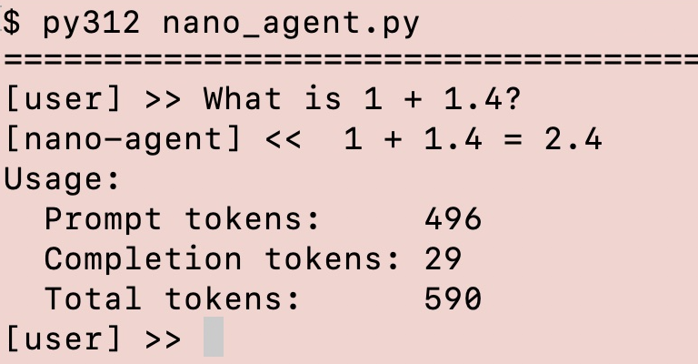

# nano-agent

**A minimal AI agent framework, built from scratch.**

`nano-agent` is a small, transparent implementation of an LLM-based agent. It provides the core machinery behind an agent without hiding it behind an agent SDK.

<p align="center">
  
</p>

## What it does

The agent can:

* interact with an LLM through an OpenAI-compatible API
* call Python tools using function calling
* maintain conversation state and long-term memory
* apply input and output guardrails
* schedule follow-up tasks
* trace its execution
* retry or diagnose API failures

## Architecture

```text
User
  │
  ▼
Agent
  ├── Input guardrails
  ├── Conversation / memory
  ├── LLM client
  │      │
  │      ▼
  │     LLM
  │      │
  │      ├── final response
  │      └── tool call
  │             │
  │             ▼
  │           Tool
  │
  ├── Scheduler
  └── Output guardrails
```

The project started with a mock LLM and was later connected to a real LLM, keeping the agent architecture unchanged.

## Project structure

```text
nano-agent/
├── nano_agent.py
├── tools.py
├── tool_defs.py
├── guardrails.py
├── utils.py
└── config.py
```

## Why?

The goal is not to build a production-ready agent framework. It is to make the fundamental mechanisms of agentic systems small enough to understand, inspect, and modify.

## Status

Experimental / educational.

Built as a learning project while exploring LLMs, tool use, memory, guardrails, scheduling, and agent architecture.

## Usage

Select the LLM backend by setting the `LLM_BACKEND` environment variable to either `mock` or `gemini` (default: `mock`).

The LLM and server settings are defined in `config.py`. Adjust these settings to match your local setup or chosen LLM provider. API keys should be supplied via environment variables rather than stored in the repository.

For the Gemini backend, set `GEMINI_API_KEY` to your API key.

When using the mock backend, start the mock server with:

```text
python mock_server.py
```

Then, in a different terminal, start the agent with:

```text
python nano_agent.py
```

The agent runs interactively, accepting tasks at the `[user] >>` prompt and returning its responses at the `[nano-agent] <<` prompt. Enter `exit` or `quit` to leave.

### Command-line options

Optional runtime parameters can be supplied when starting the agent:

```text
python nano_agent.py --max-tasks 10 --max-iter 5
```

`--max-tasks` sets the maximum number of queued tasks to process, while `--max-iter` sets the maximum number of LLM iterations allowed for each task.

Run:

```text
python nano_agent.py --help
```

to see all available options.

### Response validation

Response validation is **optional but recommended**. The framework validates the HTTP response, JSON format, and expected Chat Completions response structure. This adds a defensive layer around the LLM client while keeping the core framework minimal.


## Acknowledgement

`nano-agent` was inspired by **[A Tour of Agents](https://tinyagents.dev/learn)**, a tutorial by Arun Purushothaman that explores the core concepts behind AI agent frameworks by building an agent from scratch.

*Created with Sphynx.* 🐈
